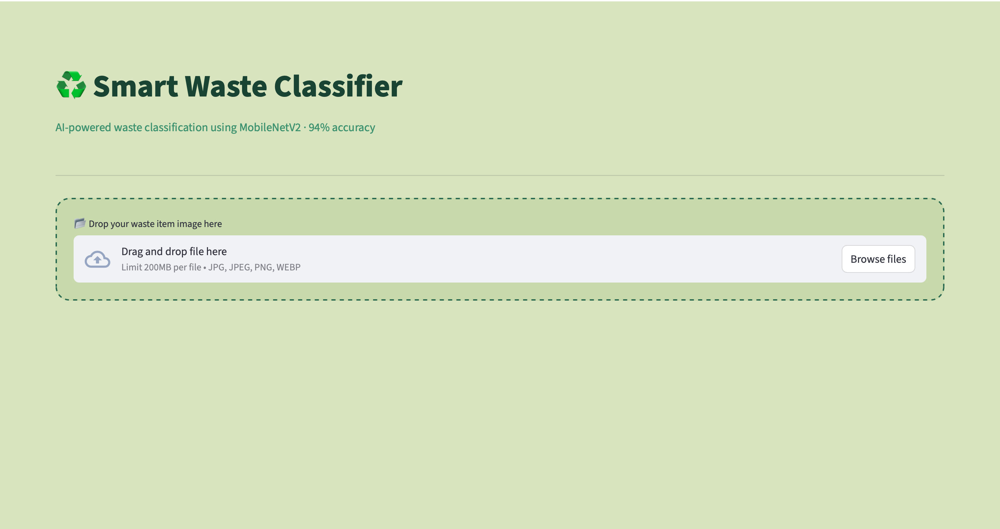
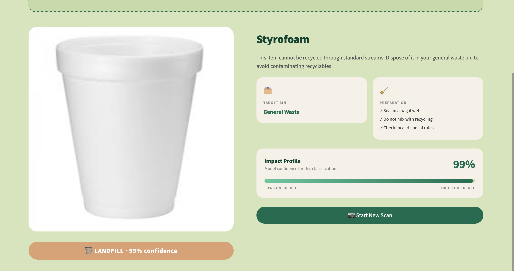

# ♻️ Smart Waste Classifier

An AI-powered waste classification web app that identifies whether a waste item is **recyclable** or should go to **landfill**.

Built with TensorFlow, MobileNetV2 transfer learning, and Streamlit.

---

## 📸 Screenshots

### Upload Screen
<!-- Add screenshot of upload screen here -->


### Result Screen
<!-- Add screenshot of result screen here -->


---

## 🛠️ Tech Stack
- Python
- TensorFlow / Keras
- MobileNetV2 (transfer learning)
- Streamlit
- Pillow

---

## 🚀 How to Run
```bash
# Clone the repo
git clone https://github.com/NehaKadam26/smart-waste-classifier.git
cd smart-waste-classifier

# Create and activate virtual environment
python -m venv venv
source venv/bin/activate

# Install dependencies
pip install -r requirements.txt

# Run the app
streamlit run app/app.py
```

---

## 📁 Project Structure
```
smart-waste-classifier/
├── app/
│   └── app.py              # Streamlit web app
├── model/
│   └── model.h5            # Trained MobileNetV2 model
├── data/                   # Training data
├── screenshots/            # App screenshots
├── 01_setup_and_data.ipynb # Day 1: Data setup
├── 02_train_model.ipynb    # Day 2: Model training
└── requirements.txt
```

---

## 🎯 Model Performance
- **Architecture:** MobileNetV2 (transfer learning)
- **Classes:** Recyclable, Landfill
- **Test Accuracy:** ~94%

---

## ⚠️ Known Limitations
- Model was trained on a specific dataset and may not generalise well to all real-world images
- Accuracy on unseen real-world images may be lower than the reported 94% test accuracy
- Model may show high confidence even when misclassifying — confidence score reflects the model's certainty, not correctness
- Classification is binary (Recyclable/Landfill) — does not distinguish between material types
- Plastic bags and cardboard may occasionally be misclassified

---

## 🔮 Future Additions
- Dynamic preparation tips using Claude Vision API based on the specific item detected
- Multi-class classification (glass, paper, metal, plastic, organic, e-waste)
- Camera input support for real-time scanning
- History log of scanned items per session
- Batch image upload and classification
- Retrain model with balanced and more diverse dataset

---

## 📅 Project Progress
- ✅ Day 1: Data setup and exploration
- ✅ Day 2: Model training (MobileNetV2)
- ✅ Day 3: Streamlit web app with custom UI
- 🔜 Day 4: Model retraining and improvements
