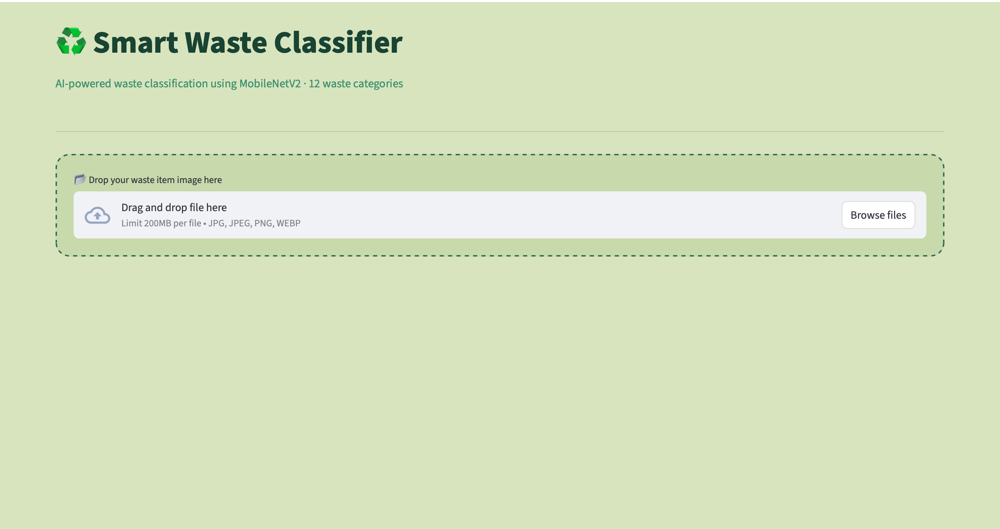
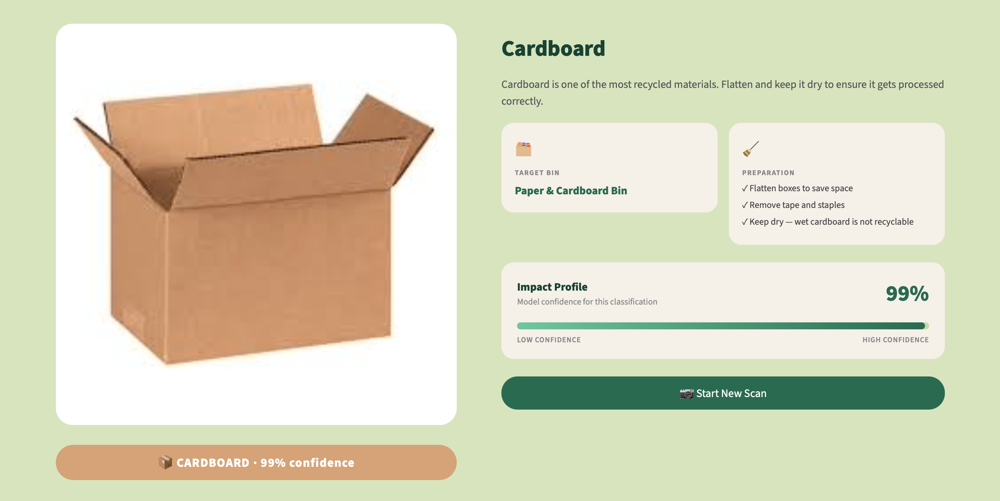
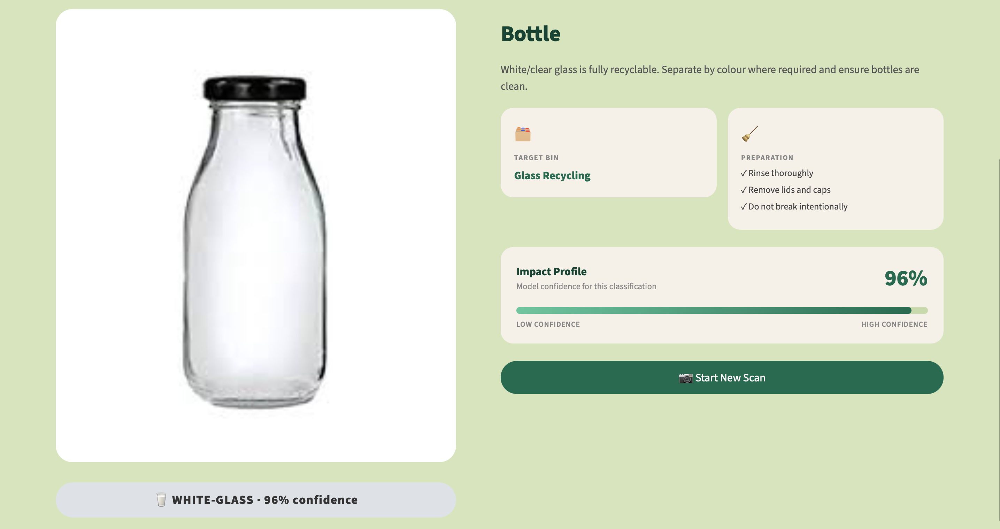
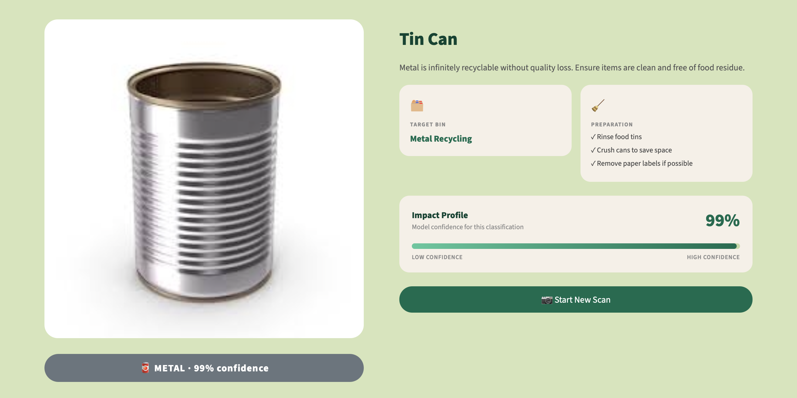
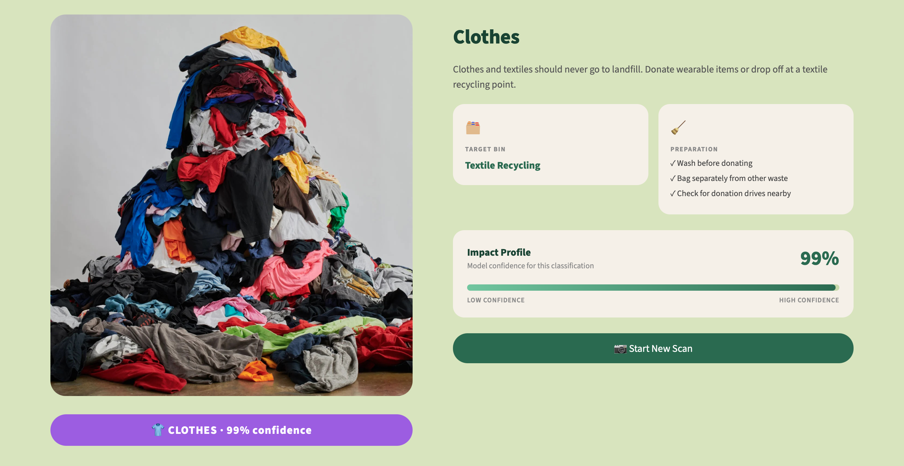
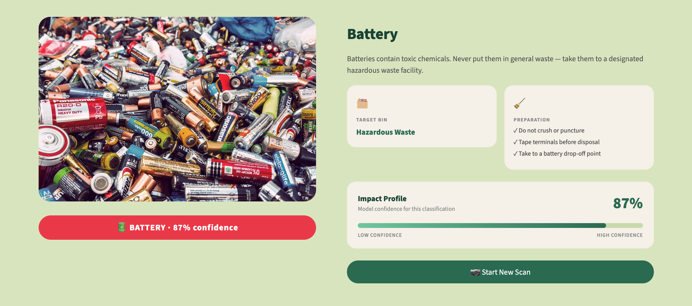
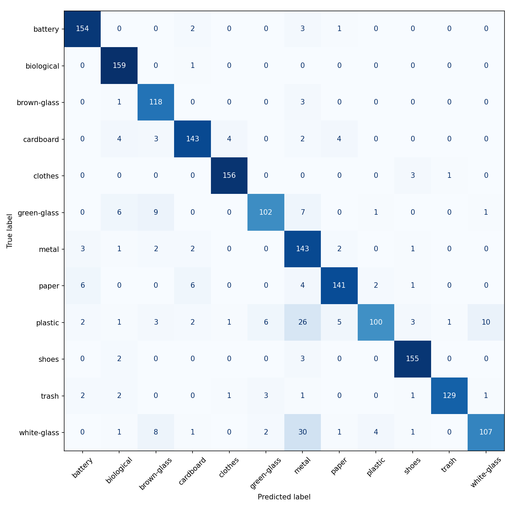

# ♻️ Smart Waste Classifier

A machine learning web app that classifies waste into 12 categories and provides disposal instructions. Built using transfer learning on MobileNetV2 and deployed with Streamlit.

**Live Demo:** [smart-waste-classifier-26.streamlit.app](https://smart-waste-classifier-26.streamlit.app)

Upload a photo of any waste item and the model tells you its category, the correct bin, and how to prepare it for disposal. Trained on 12 waste categories using MobileNetV2 with transfer learning, achieving 90.42% validation accuracy.

---

## 📸 Screenshots

### Upload Page


### Cardboard Detection


### Glass Detection


### Metal Detection


### Textile Detection


### Battery Detection


---

## 🎯 Model Performance

| Metric | Score |
|---|---|
| Training Accuracy | 93.04% |
| Validation Accuracy | 90.42% |
| Architecture | MobileNetV2 (Transfer Learning) |
| Dataset Classes | 12 |
| Epochs | 10 |
| Input Size | 224 × 224 px |

The base MobileNetV2 model was pretrained on ImageNet and used as a frozen feature extractor. A custom classification head was added on top and trained on the waste dataset. Class weights were used during training to handle the imbalance across categories.

---

## 🚀 Run Locally

**Requirements:** Python 3.11
```bash
git clone https://github.com/NehaKadam26/smart-waste-classifier.git
cd smart-waste-classifier
python -m venv venv
source venv/bin/activate        # Windows: venv\Scripts\activate
pip install -r requirements.txt
streamlit run app/app.py
```

The app will open automatically at `http://localhost:8501`.

---

## 🏗️ Project Structure
```
smart-waste-classifier/
├── app/
│   └── app.py                  # Streamlit web app
├── data/
│   ├── train/                  # Training images (12 classes)
│   └── val/                    # Validation images
├── model/
│   ├── model.h5                # Trained MobileNetV2 model
│   └── class_indices.json      # Class name → index mapping
├── notebooks/
│   ├── 01_setup_and_data.ipynb # Data preparation & splitting
│   └── 02_train_model.ipynb    # Model training & evaluation
├── screenshots/                # App screenshots
├── requirements.txt
└── README.md
```

---

## 🛠️ Tech Stack

| Layer | Technology |
|---|---|
| Model | TensorFlow / Keras |
| Architecture | MobileNetV2 (pretrained on ImageNet) |
| Web App | Streamlit |
| Image Processing | Pillow, NumPy |
| Language | Python 3.11 |


---

## 📊 Per-Class Performance

Aggregate accuracy hides class-level weaknesses, especially given the dataset's class imbalance. Full per-class breakdown from validation set evaluation:

| Category | Precision | Recall | F1 | Support |
|---|---|---|---|---|
| plastic | 0.93 | 0.62 | 0.75 | 160 |
| metal | 0.64 | 0.93 | 0.76 | 154 |
| white-glass | 0.90 | 0.69 | 0.78 | 155 |
| green-glass | 0.90 | 0.81 | 0.85 | 126 |
| brown-glass | 0.83 | 0.97 | 0.89 | 122 |
| paper | 0.92 | 0.88 | 0.90 | 160 |
| cardboard | 0.91 | 0.89 | 0.90 | 160 |
| battery | 0.92 | 0.96 | 0.94 | 160 |
| biological | 0.90 | 0.99 | 0.94 | 160 |
| trash | 0.98 | 0.92 | 0.95 | 140 |
| shoes | 0.94 | 0.97 | 0.95 | 160 |
| clothes | 0.96 | 0.97 | 0.97 | 160 |


**Confusion matrix:**



**Notable findings:**
- **Plastic** has high precision (0.93) but low recall (0.63) — the model is conservative about labeling plastic, missing ~37% of true plastic items.
- **Metal** shows the opposite pattern (precision 0.64, recall 0.93) — over-predicted, catching most real metal but also mislabeling other items as metal.
- **White-glass** recall (0.69) suggests confusion with other glass colors (brown/green-glass), a plausible failure mode for a CNN given how visually similar glass tones are.

These per-class gaps, not visible from the 90% aggregate accuracy alone, are natural next targets for further data augmentation or class-specific fine-tuning.
